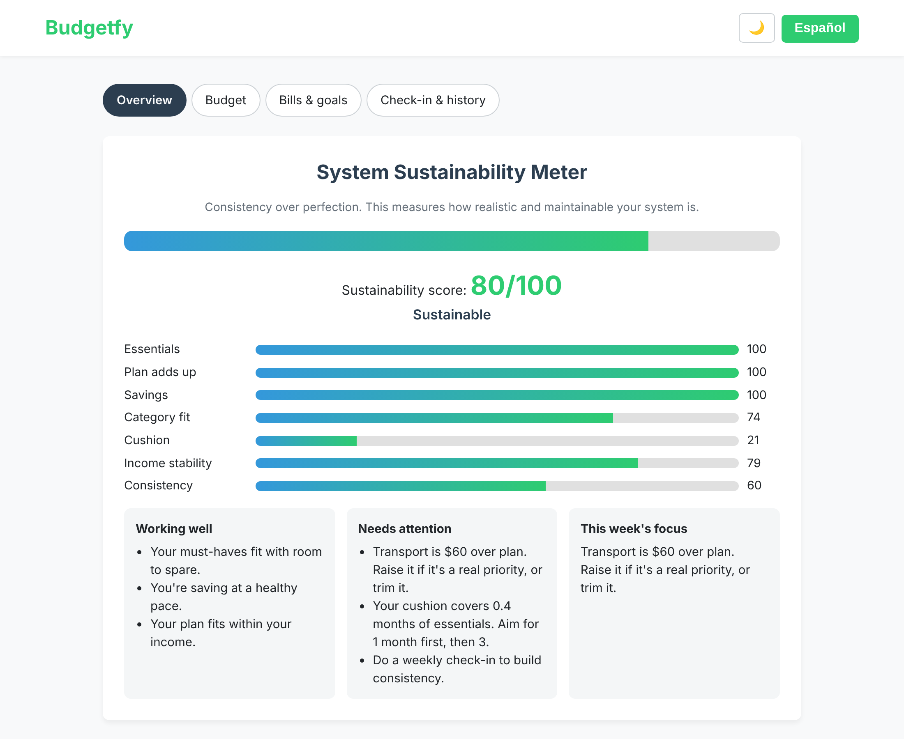

# Budgetfy

**A free, bilingual budgeting tool that scores how sustainable your budget is, not how "good" you are.**

👉 **Try it live:** https://albertoavilaemail-design.github.io/budgetfy/

## Why I built it

Most people don't quit budgeting because they're bad with money. They quit because the plan was unrealistic from the start, and every month it "fails," they feel worse. Budgetfy measures whether your *system* can actually work and tells you the one thing to adjust this week.

## Features

- **Sustainability score (0–100)** across 7 weighted factors: essentials, plan balance, savings, category fit, emergency cushion, income stability and check-in consistency
- **Fully bilingual:** English and Spanish
- **Guided setup:** enter your income and pick categories; starting amounts are suggested for you
- **Bank statement import (CSV):** sorts spending into categories, remembers your choices and skips duplicates
- **Bills and recurring payments** that log themselves on their due date
- **Savings goals** linked to your savings categories, plus **debt payoff projections**
- **Monthly close-out** with history, score trend, rollover and undo
- **Light and dark mode**, phone-friendly layout

## Design decisions

- **Score the system, not the person.** Feedback is diagnostic and encouraging, because people stick with tools that don't make them feel judged.
- **Fair to every income.** The common "50% rule" assumes rent and food fit in half your income. Budgetfy gives full credit for essentials up to 80% of income, so lower-income users aren't penalized for reality.
- **Any savings counts.** Saving anything earns at least half credit; 10% of income earns full credit.
- **Cushion measured in months.** One month of essentials is the first milestone; three months earns full credit.
- **One source of truth.** "Spent" is always calculated from logged spending, so numbers never contradict each other.
- **Private by design.** No account, no server, no tracking. Data stays in the user's browser, with backup, restore and CSV export.

## Built with

HTML, CSS and vanilla JavaScript in a single file, with no frameworks and no backend. Designed by Alberto Avila and built with AI assistance.

## Run it yourself

Download `index.html` and open it in any browser. That's it.
